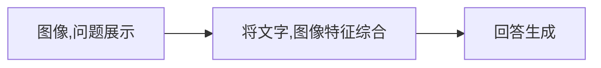

# 例会汇报 | 第一次

## **VQA算法** 

1.   **图像/问题表征方法**

-    图像展示 | Image representation
-    问题呈现 | Question representation

2.   **多模态融合与回答生成算法**  

-    将视觉信息和文字信息综合 | Fusion and/or Attention

>   The interaction of the visual and textual domain in VQA is either done directly through multimodal fusion or indirectly through attention mechanisms.                                                                          	      --- *A Comprehensive Survey on Visual Question Answering Datasets and Algorithms*

-    问题生成 | Answering

### 多模态融合

“将不同模态的信息，形成一个联合的表示”

>   We divide fusion in VQA into two types, vector operation and bilinear pooling.
>
>    --- *A Comprehensive Survey on Visual Question Answering Datasets and Algorithms*

##### 基于向量操作的融合

1.   向量操作 | Vector Operation

	通过向量操作（加法，内积，拼接），将图像特征和问题特征结合起来，生成一个联合的多模态表示。

-   容易实现
-   准确度低

2.   双线性池化层 | Bilinear pooling

	通过将代表 视觉信息 和 文字信息 的 **向量做外积**，“比简单的向量操作（如加法、乘法或拼接）更有效地捕捉模态间的相关性。”

---

##### 注意力机制 | Attention

用于让模型**聚焦**输入数据中的重要部分，减少噪音的干扰

-   注意力机制可以帮助模型动态地选择图像和文本中的重要区域或词汇

注意力机制有很多种分类方式：

比如：Soft and hard attention

按照与问题的相关程度，给图像中的对象赋值。

区别在于**soft attention**机制不会将相关度低的对象给忽视，而**hard attention**则会舍弃相关度低的对象

其他的注意力机制有

-   Grid and objct based attention

-   bottom-up and top-down attention
-   single setp and s multi-step attention

-   CO-ATTENTION AND SELF-ATTENTION

---

上面的内容相当于是让模型“理解”了问题和图像，下面需要生成回答：

### 回答生成算法

-   **分类问题 | close ending** ：

    将前面多模态融合得到的特征输入到`全连接层`，最后通过`softmax`函数得到答案的概率分布；

    (我觉得和手写数字识别类似)

    ​	

-   **自由生成 | open ending**：

    生成自由的文本（和平时的大语言模型交互所生成的回答一样）;
    
    `编码器-阶码器`结构：
    
    -   编码器提取图像和问题的联合表示
    -   解码器按照编码器输出，逐词生成答案

在回答生成算法中，Transformer模型比较流行:

**Transformer模型**

-   **提取文本、图像信息，并融合**：

    -   Two-Stream 图像和文本分别通过独立的 Transformer 编码器处理，最后再将两个输出融合。例子：ViLBERT, LXMERT, and ERNIE-ViL 

    >   In the two-stream architecture, two seperate transformers are applied to image and text and their outputs are fused by a third Transformer in a later stage.

    -   Single-Stream: 将图像和文本视为一个统一的序列，通过同一个 Transformer 编码器处理。例子：ViLT、OFA、M6、VisualBERT

    >   In contrast, single-stream models use a single transformer for joint intra-modal and inter-modal interaction.

-   **回答生成**:

    -   **分类问题 | close ending**：

        在 Transformer 编码器的输出后添加分类头（Classification Head）。

        通过全连接层将融合后的特征映射到答案词汇表的分布。

    -   **自由生成 | open ending**：

        使用 Transformer 的 **编码器-解码器架构** ，编码器得到视觉和文字特征的特征序列，输入到解码器生成答案。

---

综述中提到的其他相关内容：

##### 外部知识 | EXTERNAL KNOWLEDGE

外部知识是指从预定义的知识库（如知识图谱、数据库）或预训练模型中引入的额外知识

-   帮助模型更好地回答问题

##### 组合式推理 | Compositional reasoning

将问题拆分成多个子问题，来正确地推理复杂问题

>   By composition, we refer to the ability to break a question down into individual reasoning steps which when done sequentially produces the correct answer. “组合"指的是将问题拆分成子问题的能力

### 尝试

在了解相关模型的时候，我了解到一个基于transformer的模型框架BLIP(2022年提出)。

BLIP训练难(数据，算力)

-   [HuggingFace文档-链接](https://huggingface.co/docs/transformers/main/en/model_doc/blip#blip) 

-   [训练代码Giuhub-链接](https://github.com/salesforce/BLIP) 

---

hugging face上面有几个基于这个框架的模型，我下载了几个想看看效果是什么样的，写了一个对话的本地网页：

>    ~~**我们到时候是不是也可以将最终的模型做一个网页的demo**~~

### 有关VQA学习的疑惑

1.   学习时间有限，除非放假很难有**足够多**的时间来系统学习，学习进度缓慢。
2.   从哪里开始下手？需要先系统学习pytorch，transformer等吗？

>   python->pytorch->看一些相关实现和算法

---