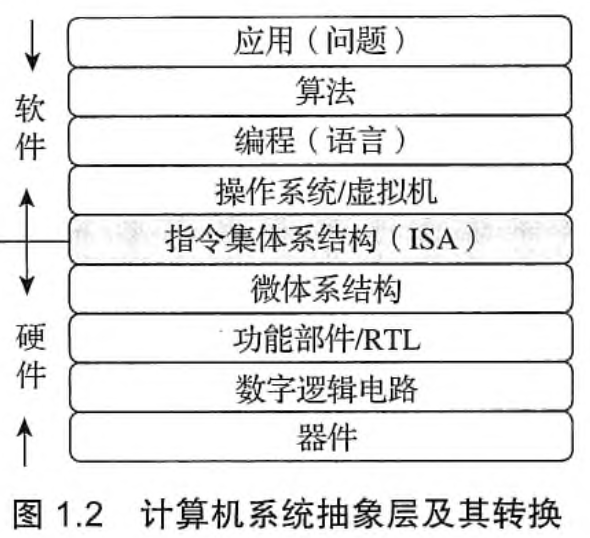

# 二进制表示

## 计算机系统概述

### 冯诺依曼结构

采用 **存储程序** 的工作方式

计算机由运算器，存储器，控制器，输入/输出设备（I/O 设备）构成。

其中：

-   存储器：存储指令和数据（指令和数据在计算机内部的表示方式一致，但是计算机由识别 他们的方法）
-   运算器：内部有 **ALU**（arithmetic and logic unit）算数逻辑单元和通用寄存器组 **GPRs**（General Purposed Register Set），**是指令的执行单元**;
-   控制器：**自动地取出指令**; 内有指令寄存器 **IR**(Instruction Register)和 **PC**(Program Count)程序计数器，前者存放从主存中取来的指令
-   I/O 设备，输入和输出

>   CPU 中 除了‘控制部件’都是运算器；
>
>   注意缩写的含义!
>
>   
>
>   图中内容来自教材

### 程序的表示和执行（核心！！！）

1.   程序在执行前：
     -   将数据和指令存放在 **内存** 中
     -   每一条指令和数据都有地址
     -   指令有序存放  （但是不一定按序执行）
     -   将程序的起始地址置入 PC（Program Count）（PC 其实是一个地址寄存器，用于寄存下一个指令的地址）

>   程序执行前指的是“从点击鼠标”到执行第一条指令前的过程

2.   程序执行的过程中：

     -   根据 PC 取指令

     -   翻译 PC 指令中的操作码

     -   根据操作码：取操作数，执行操作，将结果写入目的地址中

     -   **修改 PC 为下一条指令的地址**（这是指令依次执行的关键），再循环上述流程

         >   指令中通常包括以下信息：操作码（加减等）源操作数 1 或/和 源操作数 2（的地址）  目的操作数地址  

关于计算机读取指令的过程，还可以看下面 deepseek r1 生成的内容

>   #### **1. 取指阶段（Fetch）**
>
>   -   **目标**：从内存中读取下一条指令。
>   -   **步骤**：
>       1.  **程序计数器（PC）**：控制器中的寄存器 PC 存储当前指令的内存地址。
>       2.  **发送地址**：控制器将 PC 中的地址发送到内存。
>       3.  **读取指令**：内存根据地址返回指令内容（二进制码）。
>       4.  **存入指令寄存器（IR）**：指令被临时存入控制器的 **指令寄存器（IR）**。
>       5.  **更新 PC**：PC 自动+1（或根据跳转指令修改），指向下一条指令地址。
>
>   ------
>
>   #### **2. 解码阶段（Decode）**
>
>   -   **目标**：解析指令内容，确定操作类型和操作数。
>   -   **步骤**：
>       1.  **拆分指令**：指令分为 **操作码（Opcode）\**和\** 操作数（Operand）**。
>           -   **操作码**：指明操作类型（如加法、跳转）。
>           -   **操作数**：指明数据来源（如寄存器、内存地址）。
>       2.  **控制器生成控制信号**：根据操作码，向各部件发送控制信号（如激活 ALU、选择寄存器）。
>
>   ------
>
>   #### **3. 执行阶段（Execute）**
>
>   -   **目标**：完成指令规定的操作。
>   -   **可能的操作类型**：
>       -   **算术/逻辑运算**（由 ALU 执行）：
>           -   例如：`ADD R1, R2`（将寄存器 R1 和 R2 的值相加）。
>           -   控制器将 R1 和 R2 的数据送入 ALU，ALU 计算结果后存回指定寄存器。
>       -   **数据移动**：
>           -   例如：`LOAD R1, 0x100`（将内存地址 0x100 的数据加载到 R1）。
>           -   控制器从内存读取地址 0x100 的数据，存入寄存器 R1。
>       -   **控制流跳转**：
>           -   例如：`JMP 0x200`（跳转到地址 0x200 执行）。
>           -   直接修改 PC 的值，改变下一条指令地址。
>
>   ------
>
>   #### **4. 写回阶段（Write Back）**
>
>   -   **目标**：将执行结果写回寄存器或内存。
>   -   **例如**：运算结果存入寄存器，或内存地址更新数据。

---

### 计算机系统的抽象层

 **软硬件交互--ISA**

ISA 是硬件和软件之间的桥梁，规定了软件和硬件之间交互的接口；

ISA 是一种规约，规定了可执行的指令的集合，以及指令可以接受的操作数的类型。

---

### 机器级语言：机器语言，汇编语言 

-   机器语言：0011.....

-   汇编语言优点： 1. 可读性 2. 便于编写代码。

汇编语言程序!= 汇编程序， **汇编语言程序** 是用汇编语言写的程序；**汇编程序** 是将汇编语言转换成 **机器级语言** 的程序。

汇编符合某一个 ISA，只能在同一个 ISA 设计的 机器上运行。之所以我们写高级语言不用操心这一个，是因为有一层封装。

**硬件只能执行机器语言程序**

**编译与解释**：

1.   编译：将高级语言源程序-> 机器级语言
2.   解释：逐条翻译成

机器代码还需要通过 **指令译码器** 翻译成控制信号

---

### 一个例子

**8 位** 模型机 M：8 位定长指令字，4 个 GPR，16 个主存单元；8 位指的是指令的长度，GPR 中大部分也为 8 位；

>   目前市面上大部分的存储设备的主存单元都是 8 位

详细见 ppt。

---

##  二进制编码

机器只能执行二进制的机器代码，只能计算二进制的数据。

-   真值：01 序列代表的现实中的值
-   机器数：01 序列

1. 数值型数据

​	不同的进制：二进制 B，八进制 O，十六进制 H(或 ox- prefix)

2. 非数值型数据

**不同进制之间的转换**

1.   十进制和其他进制
2.   二进制与十六进制，二进制与八进制。

**定义数据的要素**：

1.   进制:确定是几进制
2.   定点/浮点: 因为小数点无法表示，需要有“定点”和”浮点“之分
3.   编码：确定不同的编码方式

---

这一节的重点在于：熟悉进制的转换。

##  数值型数据的表示

原码：首位是符号位！

### 定点数

定点数可以表示小数，也可以表示小数；小数的小数点默认在最左边，整数的小数点默认在最左边。

>   定点整数：小数点固定在数值位最右，**无需显式表达** 定点小数：小数点固定在数值位最左，**无需显式表达**

补码：在模 n 的运算中，任何一个数的补码是它对 n 取模后的结果。

如果用 n 位二进制来表示补码，则可以表示-2^(n--1) 到 2^(n-1)-1 的数字；

给定任何一个这个范围中的数字，对 2^n 取模，将这个结果表示为二进制，即得到了这个数的补码。

1.   显然，对于这个范围之间的正数，补码就是他的本身
2.   对于负数，先加上 $2^n$，再表示为二进制。

>   **给定一个 8 位的二进制，$2^8$-这个二进制 = 这个二进制按位取反+1；因为在这个二进制+这个二进制的取反 = $2^8$-1**

因此，计算 -1101100 的补码，只需要计算 $2^n$-1101100 的二进制表示，即 1101100 按位取反再加一

### 补码与源码之间的转换

1.   原码转成补码：

-   正数的原码就是它的补码。 
-   负数的补码是它的相反数的补码（原码）按位取反再加 1。

>   补充：负数求补码其实是求这个负数+$2^n$之后的二进制表示（原码或者说补码）而a+a按位取反+1=$2^n$ ,因此求-a的补码，即是要求 **a按位取反+1**

2.   补码转源码：

-   依然只用说负数的内容。要求负数的原码，只需要将这个补码的实际值对$2^n$取模，（将结果控制在-2^(n-1) ~2^(n-1)之间)即可得到-a的值，再把a的原码写出，加上符号位即可。

>   也可以根据下面的内容，求出原码的值

3.   补码转成真实值

>   因为补码对应的真值是 “补码对应的二进制数”-$2^{n}$ 将补码对应的二进制展开，即可得到上面的式子

也可选择先转成源码，再转成真值。

**变形补码**: 一般的补码在只能表示$-2^{n-1}$到 $2^{n-1}+1$的数据，变形补码引入了双符号位

### 移码(excess notation)

**给每一个数字加上一个偏移量**（bias or excess), 这个新的数字的二进制表示，就是原数字的偏移量。根据移码得到数字的方式->减去偏移量。

如，四位二进制表示7，-3，如果偏移量为7，那么前者表示为1110，后者表示为0100;

>   移码的出现主要是用于浮点数的阶码表示

### Singed int and Unsigned int

有符号数表示范围：$-2^{n-1}$ 到$ 2^{n-1}-1$;

无符号数表示范围：0 到 $2^{n}$;;

### 浮点数（IEEE 754）

浮点数由符号位+阶码+尾数构成；

阶码是由**移码**来表示的，bias是$2^{n-1}$; 而尾数是由**原码**来表示的。

#### 将一个数字转成浮点数编码表示

1.   11111=1.1111*$2^{4}$
2.   符号位：0； 阶码：4+127=1000 0011； 尾数：1111 0000 0000 0000 0000 000（补全至32位）
3.   最终结果：0 10000011 11110000000000000000000

#### 浮点数的表示范围

1.   32位的浮点数 1+8+23；

     -   **NAN**：阶码为FFH，尾数不为0； (Not A Num)

     >   NAN对于程序的调试有帮助

     -   **正无穷**：阶码为FFH，尾数全为0，符号位为0；**负无穷**：阶码为FFH，尾数全为0，符号位为1；
     -   0：阶吗和尾数全为零，根据符号位不同，可以有+0和-0的区别。
     -   **规格化数**的范围：$2^{127}*(2-2^{-23})$~$2^{-126}*1.0$
     -   **非规格化数**的特点是：
         -   阶码固定为 `-126`（实际指数 = 阶码值 - 127，但阶码为 `0` 时，实际指数固定为 `-126`）。
         -   **尾数没有隐含的前导 `1`**，即尾数的实际值为 `0.尾数位`。
         -   非规格化数的表示范围是：$2^{}$

     >    **规格化数**的阶码部分范围为**1~254**；阶码为0是非规格化数（阶码全零尾数非零的部分：范围是$$）

#### 浮点数的规格化

下面的回答来自deepseek

>   - ### 右规与左规
>
>       #### 右规（Right Normalization）
>       **使用场景**：当尾数绝对值 ≥ `2.0` 时，需右规。
>
>       **操作**：
>
>       1. 尾数右移 1 位。
>       2. 指数加 1。
>
>       **例子**：
>
>       $$\text{Value} = 10.110 \times 2^3
>       $$
>
>       - 尾数 `10.110` = `2.75` ≥ `2.0`，需右规。
>       - 右规后：
>         $
>         \text{Value} = 1.0110 \times 2^4
>         $
>
>       ---
>
>       #### 左规（Left Normalization）
>       **使用场景**：当尾数绝对值 < `1.0` 时，需左规。
>
>       **操作**：
>
>       1. 尾数左移 1 位。
>       2. 指数减 1。
>
>       **例子**：
>       $
>       \text{Value} = 0.1101 \times 2^3
>       $
>
>       - 尾数 `0.1101` = `0.8125` < `1.0`，需左规。
>       - 左规后：
>         $
>         \text{Value} = 1.101 \times 2^2
>         $
>
>       ---
>
>       #### 总结
>       - **右规**：尾数 ≥ `2.0` 时，尾数右移，指数加 1。
>       - **左规**：尾数 < `1.0` 时，尾数左移，指数减 1。
>       - 规范化确保尾数范围在 `[1.0, 2.0)`。
>

### 不同数据类型之间的强制类型转换

#### 整数有符号和无符号

#### float,int,double之间的转换

