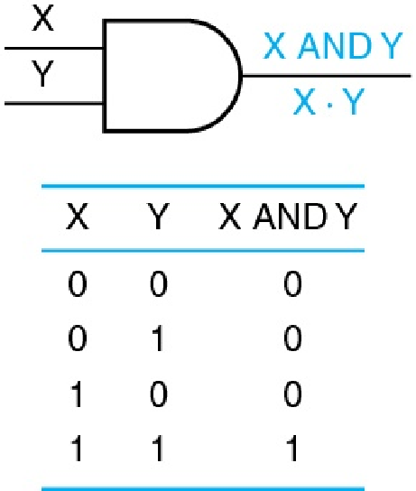
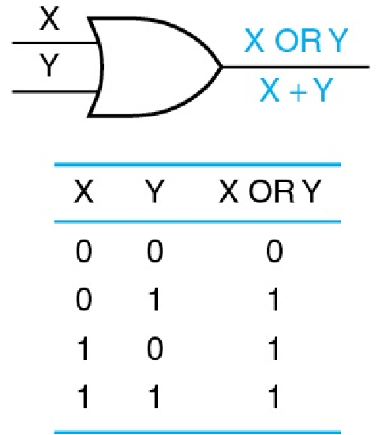
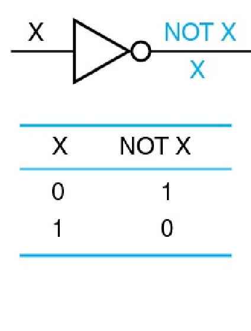
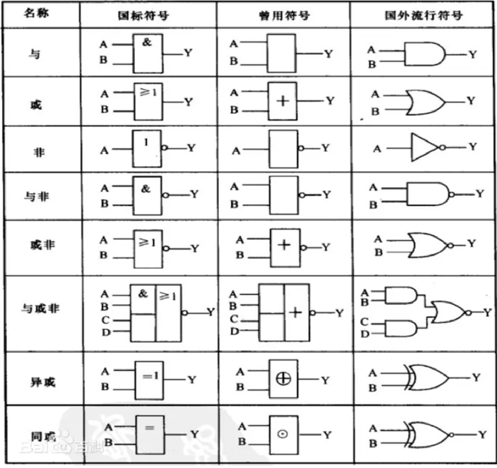
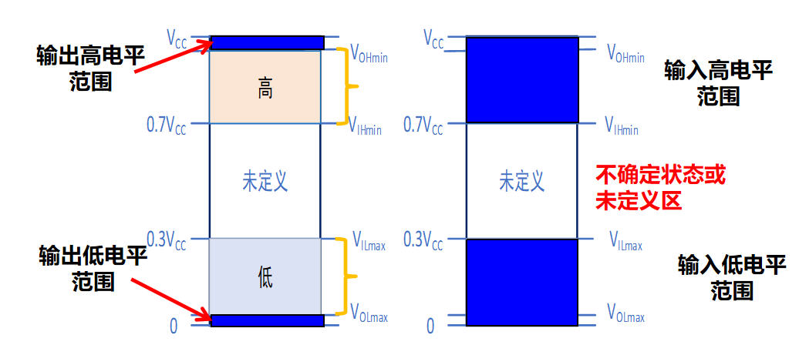
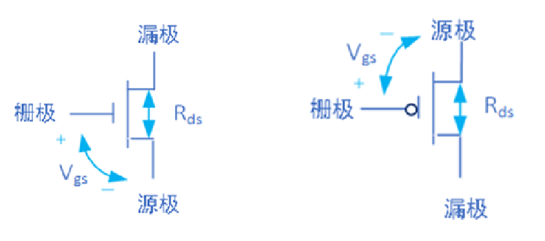
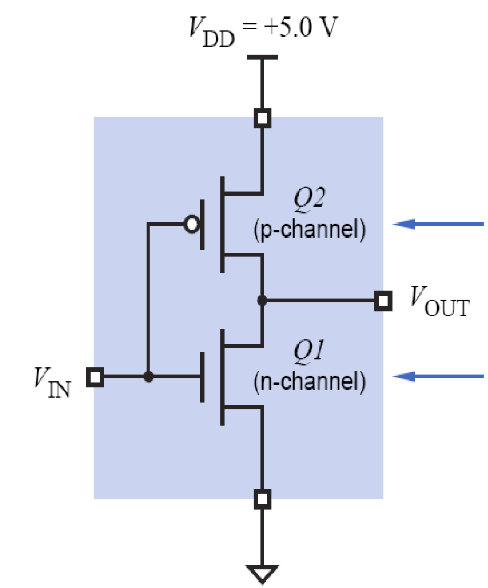
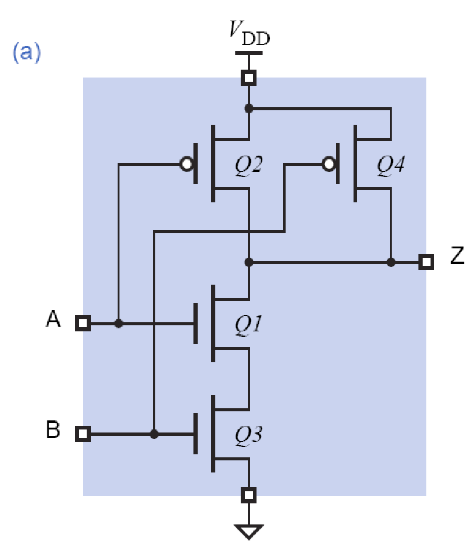

对应了实验123.

## 逻辑门与数字抽象

### 逻辑门：logic gate

直接上图：

上面的三种logic gate是基本逻辑门。

但是要记住这几种logic gate对应的运算符号。

-   $A \cdot B$, $\overline{A}$, A+B
-   $A \oplus B$
-   $A \odot B$ 

### 数字抽象

**数字抽象（逻辑采样）**：将某个物理量的实际值集映射为两个子集，对应于两个状态或两个逻辑值0和1。

在数字系统中，将一定范围内的电压映射到两个状态：高态（high）和低态（low），并用0和1来表示。

**正逻辑**将高电压映射为1，低电压映射为0；负逻辑则相反。

L or H stands for 'Low' or 'High'

-   VIHmin：确保能被识别为高态的最小输入电压值。
-   VILmax：确保能被识别为低态的最大输入电压值。
-   VOHmin：输出为高态时的最小输出电压值。

>   VIHmin小于VOHmin,即**输入识别的电压范围比较大，输出电压的范围比较窄**

-   VOLmax：输出为低态时的最大输出电压值。

>   VILmax大于VOLmax，理由同上。

>   
>
>   ​							（图中表示输入输出的电压范围）

### CMOS晶体管

MOS是三极晶体管：

-   gate栅极，通常是in的部分
-   source源极
-   drain漏极

#### NMOS和PMOS

MOS常见的是下面这两种：

左边是NMOS,上面是漏极，下面是源极；右边的PMOS相反。

更重要的区别在与：

-   对于NMOS，当Vgs<=0的时候，电阻大不导通；当Vgs>=0的时候导通
-   PMOS是，当Vgs>=0的时候不导通，当Vgs<0的时候导通。

**即栅极和源极在上面的那个电平大的时候导通**

#### CMOS晶体管

利用NMOS和PMOS构成CMOS,下面是非门(左），与非门（右）的实现方式：

**K输入**：输入k个电压，通常小于4；因为会导致噪音增大。

**级联**：将多个输入端较少的门电路级联，实现多数入。

**缓冲器**：取两次非，将信号更加精准。

>   由两个非门**级联**得到
>

#### 设计cmos电路

这篇文章值得一看[COMS门电路的设计及其优化--以异或门为例 - The Pisces - 博客园](https://www.cnblogs.com/Atsea/p/3885879.html)

这篇文章是和卡诺图有关讲得很好！  [逻辑函数的卡诺图化简 || 卡诺图 || 重点 || 数电 - 知乎](https://zhuanlan.zhihu.com/p/158535749)

由真值表得到CMOS电路：

1. 卡诺图化简
2. 画图

非门需要一对CMOS，与非门需要两对CMOS，与门需要三队CMOS。

#### CMOS的电路特性

-   转换时间：输入信号（或输出信号）从一种状态变成另外一种状态的所需的时间。
-   传播延时：输入信号变化到输出信号变化的时间。

(传播延时,tpHL是输出信号从high到low的时间，tpLH是输出信号从low到high需要的时间)

### 布尔代数

**对偶定理**

-   对偶式：将与和或互换，得到的新式子就是对偶式；（注意：运算的顺序不能改变，意味着，很多地方要加上括号）
-   如果两个逻辑表达式相等，那么逻辑表达式也相等。

**几个需要记忆的式子**

-   $(X+Y) \cdot (X+Z)=X+Y\cdot Z$
-   $(X+X \cdot Y)=X$ 
-   $X \cdot (X+Y)=X$
-   $X \cdot Y+\overline X \cdot Z+Y \cdot Z= X \cdot Y + \overline X \cdot Z$//有一项是多余的
-   $(X+Y)\cdot (\overline X +Z)\cdot (Y+Z)=(X+Y)\cdot (\overline X +Z)$

**De Morgan's law和香农定理**

### 逻辑关系描述

#### 逻辑函数

类似于predicate

#### 真值表：truth table

-   输入组合按照数值大小排序
-   每一个真值表都对应了一个一个逻辑函数

#### 波形图

用来描述逻辑函数的输出对于输入变量的变化的响应。（忽略时间延迟）

#### 逻辑函数的标准表示形式

-   乘积项
-   求和项
-   与或表达式：先与后或；sum of product
-   或与表达式：先或后与：product of sum
-   标准乘积项（极小项），只有一种情况下能够取1
-   标准求和项（极大项） ，只有一个情况下能够取0；

#### 根据真值表得到逻辑函数的表示

将最小项取和或者将最大项取积；

#### 标准表示的好处：设计电路

电路只有**两级**。

---

**标准表示不是最简**，如何将标准的表达式化成最简呢?

## 逻辑函数的化简和变化

#### 1. 代数化简

如果表达式的层级超过了两级，那么需要先转换成两级；

如果有哦整体取反运算，则需要先转换为单变量取反运算；

**技巧性较强**

#### 2. 卡诺图化简

将真值表图形化表示出来，相邻的几项是可以化简的。

