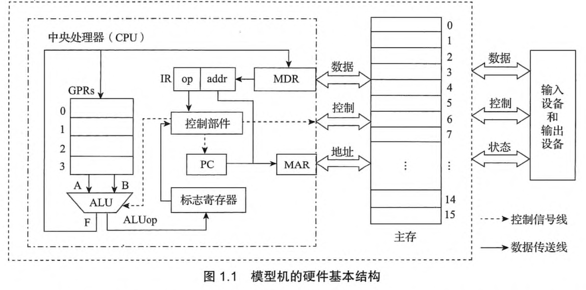
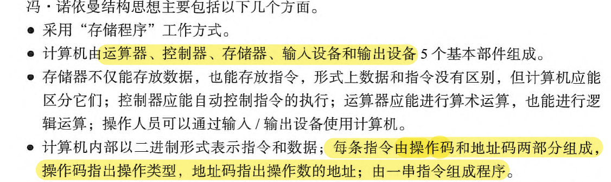
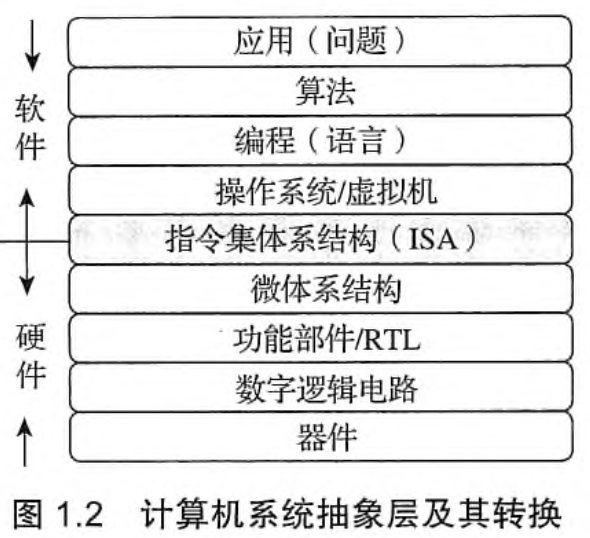

# 二进制表示

## 1.1 计算机系统概述

### 冯诺依曼结构

采用**存储程序**的工作方式

计算机由运算器，存储器，控制器，输入/输出设备（I/O设备）构成。

其中：

-   存储器：存储指令和数据（指令和数据在计算机内部的表示方式一致，但是计算机由识别 他们的方法）
-   运算器：内部有**ALU**（arithmetic and logic unit）算数逻辑单元和通用寄存器组**GPRs**（General Purposed Register Set），**是指令的执行单元**;
-   控制器：**自动地取出指令**;内有指令寄存器**IR**(Instruction Register)和**PC**(Program Count)程序计数器，前者存放从主存中取来的指令
-   I/O设备，输入和输出

>   CPU中 除了‘控制部件’都是运算器；
>
>   注意缩写的含义!
>
>   
>
>   图中内容来自教材

### 程序的表示和执行（核心！！！）

1.   程序在执行前：
     -   将数据和指令存放在**内存**中
     -   每一条指令和数据都有地址
     -   指令有序存放  （但是不一定按序执行）
     -   将程序的起始地址置入PC（Program Count）（PC其实是一个地址寄存器，用于寄存下一个指令的地址）

>   程序执行前指的是“从点击鼠标”到执行第一条指令前的过程

2.   程序执行的过程中：

     -   根据PC取指令

     -   翻译PC指令中的操作码

     -   根据操作码：取操作数，执行操作，将结果写入目的地址中

     -   **修改PC为下一条指令的地址**（这是指令依次执行的关键），再循环上述流程

         >   指令中通常包括以下信息：操作码（加减等）源操作数1 或/和 源操作数2（的地址）  目的操作数地址  

关于计算机读取指令的过程，还可以看下面deepseek r1生成的内容

>   #### **1. 取指阶段（Fetch）**
>
>   -   **目标**：从内存中读取下一条指令。
>   -   **步骤**：
>       1.  **程序计数器（PC）**：控制器中的寄存器PC存储当前指令的内存地址。
>       2.  **发送地址**：控制器将PC中的地址发送到内存。
>       3.  **读取指令**：内存根据地址返回指令内容（二进制码）。
>       4.  **存入指令寄存器（IR）**：指令被临时存入控制器的**指令寄存器（IR）**。
>       5.  **更新PC**：PC自动+1（或根据跳转指令修改），指向下一条指令地址。
>
>   ------
>
>   #### **2. 解码阶段（Decode）**
>
>   -   **目标**：解析指令内容，确定操作类型和操作数。
>   -   **步骤**：
>       1.  **拆分指令**：指令分为**操作码（Opcode）\**和\**操作数（Operand）**。
>           -   **操作码**：指明操作类型（如加法、跳转）。
>           -   **操作数**：指明数据来源（如寄存器、内存地址）。
>       2.  **控制器生成控制信号**：根据操作码，向各部件发送控制信号（如激活ALU、选择寄存器）。
>
>   ------
>
>   #### **3. 执行阶段（Execute）**
>
>   -   **目标**：完成指令规定的操作。
>   -   **可能的操作类型**：
>       -   **算术/逻辑运算**（由ALU执行）：
>           -   例如：`ADD R1, R2`（将寄存器R1和R2的值相加）。
>           -   控制器将R1和R2的数据送入ALU，ALU计算结果后存回指定寄存器。
>       -   **数据移动**：
>           -   例如：`LOAD R1, 0x100`（将内存地址0x100的数据加载到R1）。
>           -   控制器从内存读取地址0x100的数据，存入寄存器R1。
>       -   **控制流跳转**：
>           -   例如：`JMP 0x200`（跳转到地址0x200执行）。
>           -   直接修改PC的值，改变下一条指令地址。
>
>   ------
>
>   #### **4. 写回阶段（Write Back）**
>
>   -   **目标**：将执行结果写回寄存器或内存。
>   -   **例如**：运算结果存入寄存器，或内存地址更新数据。

---

### 计算机系统的抽象层

 **软硬件交互--ISA**

ISA是硬件和软件之间的桥梁，规定了软件和硬件之间交互的接口；

ISA是一种规约，规定了可执行的指令的集合，以及指令可以接受的操作数的类型。

---

