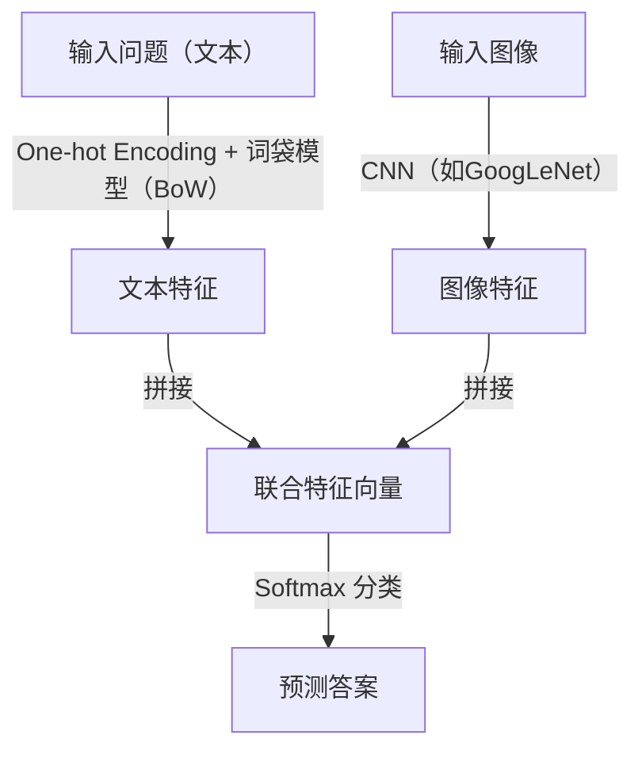
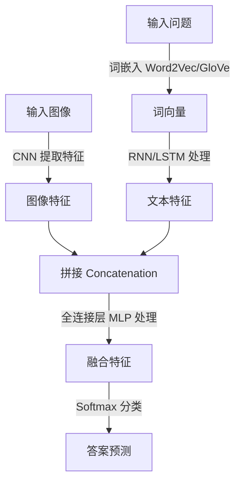
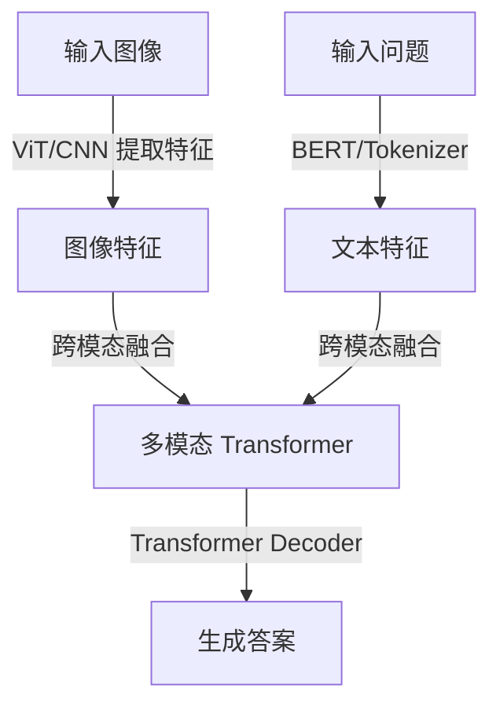

# 例会汇报 | 第二次

（接上一次BLIP系列模型的讨论）我没有仔细看对应的论文，下方图片来自知乎。

---

#### 一个VQA领域的baseline模型

>   Baseline模型的含义： 容易实现、功能基础的模型，作为'基线'(baseline)。

我找到一篇10年前的论文：<a href="paper.html">Simple Baseline for Visual Question Answering</a>，文章中提到的“iBowing”模型的结构是：

模型核心思路如下：

1.  **文字处理**

    -   **One-hot Encoding 与 Bag-of-Words (BoW)：**
         模型首先将输入的问句转换为 one-hot 向量。在 one-hot encoding 中，每个单词都表示为一个二值向量（只有对应单词的位置为 1，其余位置为 0）。这种方法正是实现了所谓的“词袋模型”（Bag-of-Words），该模型只关注词汇的出现频率而忽略词序。

    >   Bow（词袋模型）是只统计单词在词汇表中的出现情况，忽略了单词的语义关系和次序关系。
    >
    >   **但是**，这个模型并没有直接使用one-hot向量，而是通入一个嵌入层，实现词嵌入: The input question is first converted to a one-hot vector, which is transformed to word feature via a word embedding layer

    -   **Word Embedding（词嵌入）：**
         将 one-hot 向量输入到词嵌入层中，转换为低维稠密向量。词嵌入能够捕捉单词之间的语义关系，比简单的频数统计提供了更丰富的语义信息。

2.  **图像处理**

    -   利用预训练 CNN（例如 GoogLeNet）提取图像深度特征，获得图像的高层语义信息。

3.  **特征拼接（Concatenation）：**
     将文字特征和图像特征直接进行拼接，即将两个向量**横向连接**，形成一个联合特征向量。这种拼接方式能够同时包含问题的文本信息和图像的视觉信息，为后续的分类提供全面的输入特征。

    >   这里的**拼接**是这个含义：
    >
    >   -   **文本特征向量**：`T = [0.2, 0.5, 0.3]`  （假设 3 维向量）
    >   -   **图像特征向量**：`I = [0.7, 0.1, 0.9, 0.4]`  （假设 4 维特征）
    >
    >   那么，拼接后的 **联合特征向量** `F` 就是：F=[0.2,0.5,0.3,0.7,0.1,0.9,0.4]
    >
    >   

    
图片来自论文：https://arxiv.org/abs/1512.02167

    

4.  **答案生成**

    使用Softmax 分类器：
     	将拼接后的联合特征输入到一个 softmax 层，该层作为多类别分类器，计算每个预定义答案类别的概率分布。最终，选择具有最高概率的答案作为模型的输出。

softmax最终得到一个概率分布的张量，对应的概率代表答案是对应的词的概率

>   Softmax **只能从一个固定的候选集合中选答案**。这个集合通常是 **训练数据中学习到的可能答案集合**，也就是 **预定义的词表（Vocabulary）**。也就是说无法生成自由的回答。

github：[zhoubolei/VQAbaseline: Simple Baseline for Visual Question Answering](https://github.com/zhoubolei/VQAbaseline)(但是不是用python写的，而是lua，在线的demo也已经停止运行)

---

**训练的细节和结果** 

论文中使用到的数据集是`COCO数据集`，论文中提到训练的细节：`在单个 NVIDIA Titan Black GPU 上训练大约需要 10 小时`

>原文：The training takes about 10 hours on a single GPU NVIDIA Titan Black

这个是阿里云上GPU的价格。

也就是说，按照这篇论文所说，训练这个模型，可能花费30r不到。

下面是论文中提到的测试的结果：

---

老师注： 数据重要性大于算力，显存要求大于cuda核，训练满一点没关系。

论文里对模型的分析，要和其他的模型进行对比，还要进行**剖分实验** （without这个模块，之后性能怎么样？ 把这个component换成别的性能怎么样），敏感度，模型性能随着参数的变化的变化趋势

前面提到的那个baseline模型使用简单的`特征提取-> 特征融合 -> softmax得到答案`。

具体的来说，iBowing模型在文字编码时采用的是**Bow**(词袋模型). 比词袋模型用的更广泛的是：**RNN**(循环神经网络)。下面展示是一种早期常见的vqa方法：

许多vqa模型都是基于transformer实现的。下图是一个简单的结构，BLIP采取的结构和这个很相似：

---