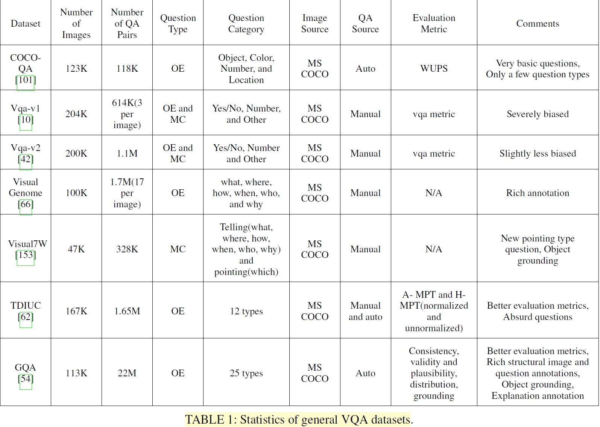
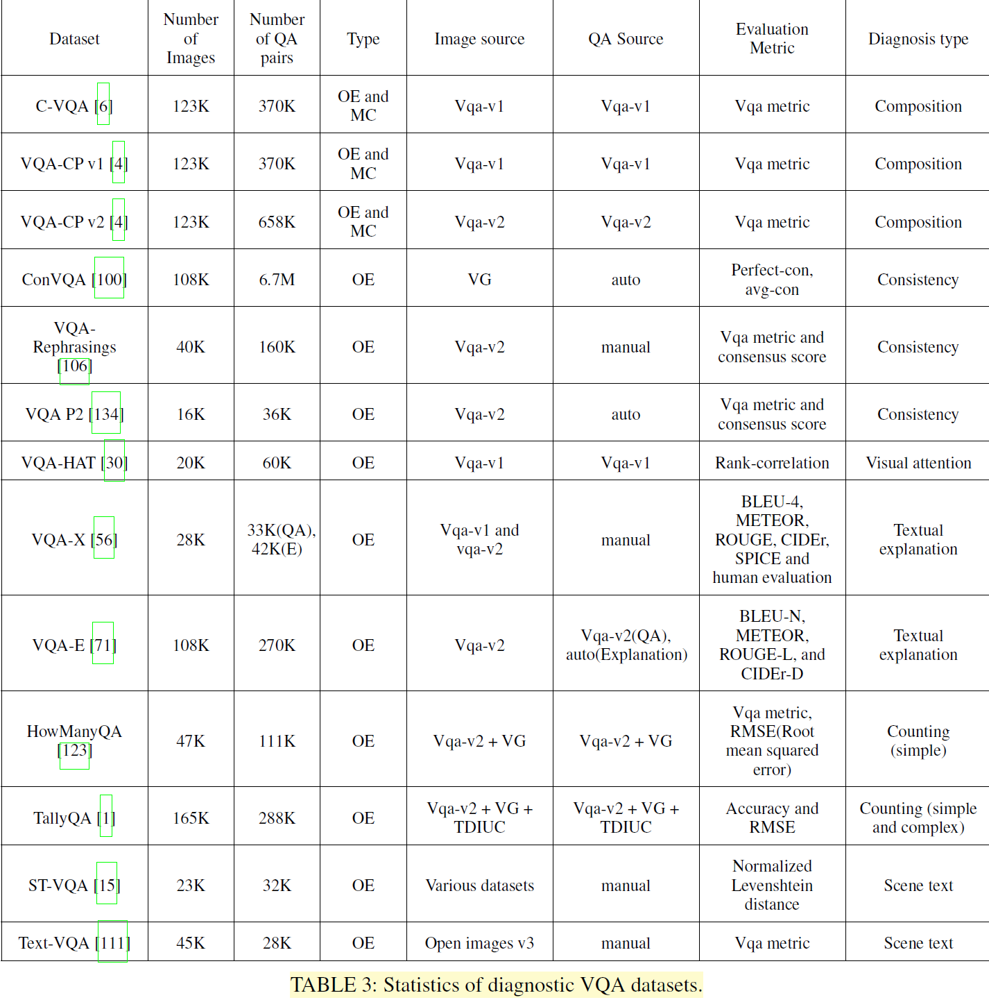
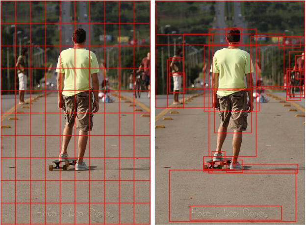
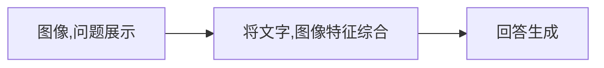
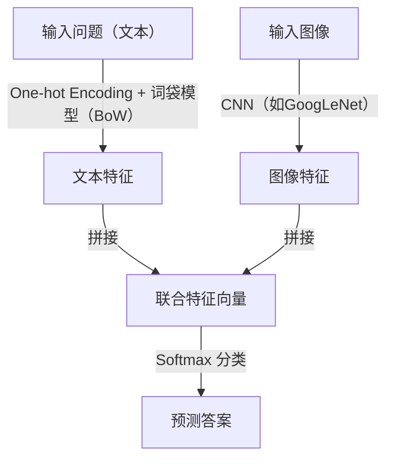
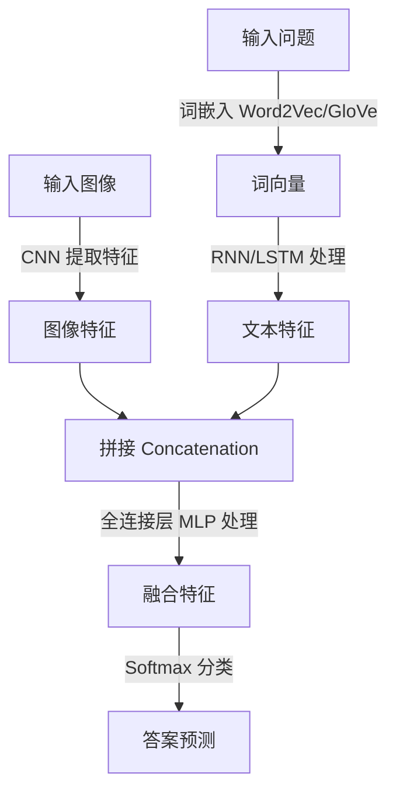
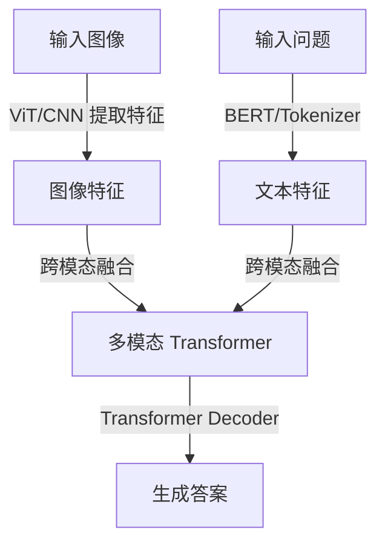

# VQA 综述阅读：

>   This passage is a reading note of a survey on VQA. Reading the raw passage is recommened:[A Comprehensive Survey on Visual Question Answering Datasets and Algorithms](https://arxiv.org/pdf/2411.11150)

## Abstract:

**Datasets**: We can devide the datasets of VQA into 4 catecories, namely:

•Available datasets that contain a rich collection of authentic images
•Synthetic datasets that contain only synthetic images produced through artificial means
•Diagnostic datasets that are specially designed to test model performance in a particular area, e.g., understanding the scene text
•KB (Knowledge-Based) datasets that are designed to measure a model’s ability to utilize outside knowledge

**Main paradigms**: In this survey, we wlii explore six main paradigms:

-   Fusion is where we discuss different methods of fusing information between visual and textual modalities.
-    Attention is the technique of using information from one modality to filter information from another. External knowledge base where we discuss different models utilizing outside information.
-    Composition or Reasoning, where we analyze techniques to answer advanced questions that require complex reasoning steps.
-    Explanation, which is the process of generating visual and/or textual descriptions to verify
    sound Reasoning.
-    Graph models which encode and manipulate relationships through nodes in a graph. 

We also discuss some miscellaneous topics, such as scene text understanding, counting, and bias reduction.

**Problems**: VQA compasses the following questions:

• Object recognition: What is behind the chair?
• Object detection: Are there any people in the image?
• Counting: How many dogs are there?
• Scene classification: Is it raining?
• Attribute classification: Is the person happy?

## Datasets

### General datasets

General datasets are the largest, richest, and most used datasets in VQA. General datasets contain many thousands of
real-world images from mainstream image datasets like MSCOCO [74] and Imagenet [32]. These datasets are notable for
their large scope and diversity. This variety is important as VQA datasets need to reflect the general nature of VQA. Although
these datasets do not necessarily capture the endless complexity and variety of visuals in real life, they achieve a close approximation.

### Synthetic datasets (虚构的)

Synthetic datasets contain artificial images, produced using software, instead of real images. A good VQA model should
be able to perform well on both real and synthetic data like  humans do. Synthetic datasets are easier, less expensive, and
less time-consuming to produce as the building of a large dataset can be automated. Synthetic datasets can be tailored
so that performing well on them requires better reasoning and  composition skills.

### Dignostic datasets

Diagnostic datasets are specialized in the sense that they test a model’s ability in a particular area. They are usually small in size and are meant to complement larger, more general datasets by diagnosing the model’s performance in a distinct area which may not have pronounced results in the more  general dataset.

### KB datasets

Sometimes it is not possible to answer a question with  only the information present in the image. In such cases, the required knowledge has to be acquired from external  sources. This is where KB datasets come in. They provide questions that require finding and using external knowledge. KB datasets can teach a model to know when it needs to search for absent knowledge and how to acquire that knowledge.

### Evaluation datasets

A model’s performance being correctly evaluated depends on the evaluation metric used. Unfortunately, a major problem of VQA is that there is no widely agreed upon evaluation metric. Many different metrics have been proposed.

## Algoritms

### Image Representation

**1. CNN**

-   When given an input image, a CNN goes through several  convolution and pooling layers to produce a C × W × H shaped output.
-   Devide the image into grids
-   Problem: be distracted by noise (could be solved by Attention mechanism); one boject could be devided into multi adjacent blocks. 

**2. Object Detection**

-   Example: Fast R-CNN

-   They produce multiple bounding boxes. Each bounding box usually contains an object belonging to a specific object class.
-   Devide the image into multiple 'bounding box'
-   Problem: possible information loss (some information that is not in the bounding boxes would be dismissed)

​								**CNN(left) and Faster R-CNN(right).**

### Questions Representation

Question representation in VQA is usually done by first embedding individual words and then using an RNN or a CNN to produce an embedding of the entire question.

>   Here are the explanations from Grok3:
>
>   1.   Take a question like "What color is the car?"
>
>   2.   **Embed individual words**: Convert each word into a vector using a word embedding technique (e.g., "What" → [0.1, 0.3, ...], "color" → [0.4, -0.1, ...], etc.).
>
>   3.   **Process with an RNN or CNN**:
>
>        -   RNN: Feed the vectors in sequence, and the final hidden state is the question embedding.
>
>        -   CNN: Apply filters to the sequence, pool the results, and get the question embedding.
>
>   4.   The output is a single vector representing the whole question, which the VQA model can then combine with image features to generate an answer.

### Fusion and Attention

We will tlk about it in the following part

### Answering

Here’s a quick summary of how "answering" works in Visual Question Answering (VQA) based on the "Answering" section (D) from the survey’s algorithm part:

In VQA, answering can be **open-ended** (free-form answers) or **multiple-choice** (choosing from options). There are two main ways to predict answers for open-ended VQA:

1. **Non-Generative Approach** (Most Common):
   - Treats answers as predefined classes (e.g., all unique answers in the dataset).
   - Two types:
     - **Single-Label Classification**: The model predicts one answer by outputting a probability distribution (using softmax) over all possible answers, trained to maximize the probability of the most agreed-upon answer from annotators. It’s simple but ignores multiple valid answers.
     - **Multi-Label Regression**: The model predicts scores for multiple candidate answers, reflecting how many annotators agreed (e.g., VQA-v1 uses a soft score like `min(# humans agreeing / 3, 1)`). This handles multiple correct answers better. The BUTD model pioneered this by treating it as a regression task, and most modern models follow this approach.
   - **Pros**: Easy to implement and evaluate.
   - **Cons**: Can’t predict new answers not seen in training.

2. **Generative Approach**:
   - Uses an RNN to generate answers word by word.
   - **Issue**: Hard to evaluate, so it’s rarely used.

For **Multiple-Choice VQA**:
- Treated as a ranking problem: The model scores each question-image-answer trio, and the highest-scoring answer wins.

**Answer Representation**:

- Most models use **one-hot vectors** (e.g., [1, 0, 0] for "dog") for answers, which is simple but loses semantic meaning—e.g., "cat" and "German Shepherd" are equally wrong compared to "dog."
- Some newer approaches embed answers into the same semantic space as questions (like word vectors), turning answering into a regression of answer vectors. This makes "German Shepherd" closer to "dog" than "cat," improving the model’s understanding and training signal.

In short, modern VQA answering leans toward multi-label regression for open-ended questions, using soft scores from annotators, while multiple-choice uses ranking. Efforts are ongoing to make answer representations more semantically rich!

### Mutilmodel Fusion

In order to perform joint reasoning on a QA pair, information from the two modalities have to mix and interact. This can be achieved by multimodal fusion. We divide fusion in VQA into two types, **vector operation** and **bilinear pooling**.

#### Vector operation

In vector addition and multiplication, question and image features are projected linearly through fully-connected layers to match their dimensions. 

>   Namely: fusion the vector of image and question by vector operation

-   cons: Bad Accuarcy

#### Bilinear pooling

>   The following content is generated by Grok3 for the raw survey is too hard for me.  ಥ_ಥ

**Bilinear Pooling** combines question and image feature vectors (e.g., both 2048-dimensional) by computing their **outer product**, capturing all interactions between them. For an output \( <z_i \) (answer score), it’s defined as \( z_i = x^T W_i y \), where \( x \) is the question vector, \( y \) is the image vector, and \( W \) is a huge weight tensor. However, with 3000 answer classes, this requires billions of parameters (e.g., 12.5 billion), making it computationally expensive and prone to overfitting. Different models tweak this to balance complexity and performance:

>   1. **MCB (Multimodal Compact Bilinear)**:
>       - Uses a trick from math: the outer product’s "count sketch" can be computed as a convolution of individual sketches.
>       - Replaces convolution with an efficient element-wise product in FFT space to indirectly get the outer product.
>       - Still has many parameters due to fixed random settings.
>
>   2. **MLB (Multimodal Low-rank Bilinear)**:
>       - Reduces parameters by decomposing \( W = U V^T \), turning \( z_i = 1^T (U_i^T x \circ V_i^T y) \) (where \( \circ \) is element-wise multiplication).
>       - Limits \( W \)’s rank to \( k \), cutting complexity, and adds a matrix \( P_i \) for further reduction.
>       - Downside: Slow to train and sensitive to tuning.
>
>   3. **MFB (Multimodal Factorized Bilinear)**:
>       - Tweaks MLB by adjusting \( U \) and \( V \) dimensions and adding **sum pooling** over windows of size \( k \): \( z = SumPool(U'^T x \circ V'^T y, k) \).
>       - MLB is a special case when \( k = 1 \). **MFH** stacks MFBs for richer pooling.
>
>   4. **MUTAN (Multimodal Tucker Fusion)**:
>       - Uses **Tucker decomposition**: \( W = \tau_c \times W_q \times W_v \times W_o \).
>       - \( W_q \) and \( W_v \) project question and image vectors, \( \tau_c \) controls interaction complexity, and \( W_o \) scores answers.
>       - MCB and MLB are simpler versions of this.
>
>   5. **BLOCK**:
>       - Uses **block-term decomposition**, balancing MLB (many small blocks, high-dimensional but weak interactions) and MUTAN (one big block, strong interactions but less accurate projections).
>       - Strikes a middle ground and often performs better.

In short, bilinear pooling fuses question and image data via their outer product, but raw computation is impractical. These models (MCB, MLB, MFB, MUTAN, BLOCK) reduce parameters in clever ways, trading off expressiveness (how much they capture) and trainability (how easy they are to optimize). Each improves on the last, with BLOCK aiming for the best of both worlds!

### Attention

Make the model to focus on the object that are more relavant to **questions** to filter out noise and imrove accuarcy.

####  Soft and hard attention

Both of **soft attention** and **hard attention** use the question to make a map, which assigns the objects on the picture to different values--the more relavent, the higher the value is.

But the difference lies in:

-   **Soft attention**  assigns all the object to a cretain value, do not dismiss any objects;
-   **Hard attention** discard those with low relavance, and only cares about those relavent to the questions

#### Grid and objct based attention

#### BOTTOM-UP AND TOP-DOWN ATTENTION

#### CO-ATTENTION AND SELF-ATTENTION

>   To get more about these attention machenism, read the raw paper.

### External Knowledge

Sometimes the model need more information to solve the problem,int that case, we need to give the model the capability to query an **External Knowledge Base** or **EKB**.

---

# 例会汇报 | 第一次

## **VQA算法** 

1.   **图像/问题表征方法**

-    图像展示 | Image representation
-    问题呈现 | Question representation

2.   **多模态融合与回答生成算法**  

-    将视觉信息和文字信息综合 | Fusion and/or Attention

>   The interaction of the visual and textual domain in VQA is either done directly through multimodal fusion or indirectly through attention mechanisms.                                                                          	      --- *A Comprehensive Survey on Visual Question Answering Datasets and Algorithms*

-    问题生成 | Answering

### 多模态融合

“将不同模态的信息，形成一个联合的表示”

>   We divide fusion in VQA into two types, vector operation and bilinear pooling.
>
>     --- *A Comprehensive Survey on Visual Question Answering Datasets and Algorithms*

##### 基于向量操作的融合

1.   向量操作 | Vector Operation

​	通过向量操作（加法，内积，拼接），将图像特征和问题特征结合起来，生成一个联合的多模态表示。

-   容易实现
-   准确度低

2.   双线性池化层 | Bilinear pooling

​	通过将代表 视觉信息 和 文字信息 的 **向量做外积**，“比简单的向量操作（如加法、乘法或拼接）更有效地捕捉模态间的相关性。”

---

##### 注意力机制 | Attention

用于让模型**聚焦**输入数据中的重要部分，减少噪音的干扰

-   注意力机制可以帮助模型动态地选择图像和文本中的重要区域或词汇

注意力机制有很多种分类方式：

比如：Soft and hard attention

按照与问题的相关程度，给图像中的对象赋值。

区别在于**soft attention**机制不会将相关度低的对象给忽视，而**hard attention**则会舍弃相关度低的对象

其他的注意力机制有

-   Grid and objct based attention

-   bottom-up and top-down attention
-   single setp and s multi-step attention

-   CO-ATTENTION AND SELF-ATTENTION

---

上面的内容相当于是让模型“理解”了问题和图像，下面需要生成回答：

### 回答生成算法

-   **分类问题 | close ending** ：

    将前面多模态融合得到的特征输入到`全连接层`，最后通过`softmax`函数得到答案的概率分布；

    (我觉得和手写数字识别类似)

    ​	

-   **自由生成 | open ending**：

    生成自由的文本（和平时的大语言模型交互所生成的回答一样）;
    
    `编码器-阶码器`结构：
    
    -   编码器提取图像和问题的联合表示
    -   解码器按照编码器输出，逐词生成答案

在回答生成算法中，Transformer模型比较流行:

**Transformer模型**

-   **提取文本、图像信息，并融合**：

    -   Two-Stream 图像和文本分别通过独立的 Transformer 编码器处理，最后再将两个输出融合。例子：ViLBERT, LXMERT, and ERNIE-ViL 

    >   In the two-stream architecture, two seperate transformers are applied to image and text and their outputs are fused by a third Transformer in a later stage.

    -   Single-Stream: 将图像和文本视为一个统一的序列，通过同一个 Transformer 编码器处理。例子：ViLT、OFA、M6、VisualBERT

    >   In contrast, single-stream models use a single transformer for joint intra-modal and inter-modal interaction.

-   **回答生成**:

    -   **分类问题 | close ending**：

        在 Transformer 编码器的输出后添加分类头（Classification Head）。

        通过全连接层将融合后的特征映射到答案词汇表的分布。

    -   **自由生成 | open ending**：

        使用 Transformer 的 **编码器-解码器架构** ，编码器得到视觉和文字特征的特征序列，输入到解码器生成答案。

---

综述中提到的其他相关内容：

##### 外部知识 | EXTERNAL KNOWLEDGE

外部知识是指从预定义的知识库（如知识图谱、数据库）或预训练模型中引入的额外知识

-   帮助模型更好地回答问题

##### 组合式推理 | Compositional reasoning

将问题拆分成多个子问题，来正确地推理复杂问题

>   By composition, we refer to the ability to break a question down into individual reasoning steps which when done sequentially produces the correct answer. “组合"指的是将问题拆分成子问题的能力

### 尝试

在了解相关模型的时候，我了解到一个基于transformer的模型框架BLIP(2022年提出)。

BLIP训练难(数据，算力)

-   [HuggingFace文档-链接](https://huggingface.co/docs/transformers/main/en/model_doc/blip#blip) 

-   [训练代码Giuhub-链接](https://github.com/salesforce/BLIP) 

---

hugging face上面有几个基于这个框架的模型，我下载了几个想看看效果是什么样的，写了一个对话的本地网页：

>    ~~**我们到时候是不是也可以将最终的模型做一个网页的demo**~~

### 有关VQA学习的疑惑

1.   学习时间有限，除非放假很难有**足够多**的时间来系统学习，学习进度缓慢。
2.   从哪里开始下手？需要先系统学习pytorch，transformer等吗？

>   python->pytorch->看一些相关实现和算法

---

# 例会汇报 | 第二次

（接上一次BLIP系列模型的讨论）我没有仔细看对应的论文，下方图片来自知乎。

---

#### 一个VQA领域的baseline模型

>   Baseline模型的含义： 容易实现、功能基础的模型，作为'基线'(baseline)。

我找到一篇10年前的论文：<a href="paper.html">Simple Baseline for Visual Question Answering</a>，文章中提到的“iBowing”模型的结构是：

模型核心思路如下：

1.  **文字处理**

    -   **One-hot Encoding 与 Bag-of-Words (BoW)：**
         模型首先将输入的问句转换为 one-hot 向量。在 one-hot encoding 中，每个单词都表示为一个二值向量（只有对应单词的位置为 1，其余位置为 0）。这种方法正是实现了所谓的“词袋模型”（Bag-of-Words），该模型只关注词汇的出现频率而忽略词序。

    >   Bow（词袋模型）是只统计单词在词汇表中的出现情况，忽略了单词的语义关系和次序关系。
    >
    >   **但是**，这个模型并没有直接使用one-hot向量，而是通入一个嵌入层，实现词嵌入: The input question is first converted to a one-hot vector, which is transformed to word feature via a word embedding layer

    -   **Word Embedding（词嵌入）：**
         将 one-hot 向量输入到词嵌入层中，转换为低维稠密向量。词嵌入能够捕捉单词之间的语义关系，比简单的频数统计提供了更丰富的语义信息。

2.  **图像处理**

    -   利用预训练 CNN（例如 GoogLeNet）提取图像深度特征，获得图像的高层语义信息。

3.  **特征拼接（Concatenation）：**
     将文字特征和图像特征直接进行拼接，即将两个向量**横向连接**，形成一个联合特征向量。这种拼接方式能够同时包含问题的文本信息和图像的视觉信息，为后续的分类提供全面的输入特征。

    >   这里的**拼接**是这个含义：
    >
    >   -   **文本特征向量**：`T = [0.2, 0.5, 0.3]`  （假设 3 维向量）
    >   -   **图像特征向量**：`I = [0.7, 0.1, 0.9, 0.4]`  （假设 4 维特征）
    >
    >   那么，拼接后的 **联合特征向量** `F` 就是：F=[0.2,0.5,0.3,0.7,0.1,0.9,0.4]
    >
    >   

    
图片来自论文：https://arxiv.org/abs/1512.02167

    

4.  **答案生成**

    使用Softmax 分类器：
     	将拼接后的联合特征输入到一个 softmax 层，该层作为多类别分类器，计算每个预定义答案类别的概率分布。最终，选择具有最高概率的答案作为模型的输出。

softmax最终得到一个概率分布的张量，对应的概率代表答案是对应的词的概率

>   Softmax **只能从一个固定的候选集合中选答案**。这个集合通常是 **训练数据中学习到的可能答案集合**，也就是 **预定义的词表（Vocabulary）**。也就是说无法生成自由的回答。

github：[zhoubolei/VQAbaseline: Simple Baseline for Visual Question Answering](https://github.com/zhoubolei/VQAbaseline)(但是不是用python写的，而是lua，在线的demo也已经停止运行)

---

**训练的细节和结果** 

论文中使用到的数据集是`COCO数据集`，论文中提到训练的细节：`在单个 NVIDIA Titan Black GPU 上训练大约需要 10 小时`

>原文：The training takes about 10 hours on a single GPU NVIDIA Titan Black

这个是阿里云上GPU的价格。

也就是说，按照这篇论文所说，训练这个模型，可能花费30r不到。

下面是论文中提到的测试的结果：

---

老师注： 数据重要性大于算力，显存要求大于cuda核，训练满一点没关系。

论文里对模型的分析，要和其他的模型进行对比，还要进行**剖分实验** （without这个模块，之后性能怎么样？ 把这个component换成别的性能怎么样），敏感度，模型性能随着参数的变化的变化趋势

# 例会汇报 | 第三次

### 部分早期的vqa方法

前面提到的那个baseline模型使用简单的`特征提取-> 特征融合 -> softmax得到答案`。

具体的来说，iBowing模型在文字编码时采用的是**Bow**(词袋模型). 比词袋模型用的更广泛的是：**RNN**(循环神经网络)。下面展示是一种早期常见的vqa方法：

### 现代的vqa方法

许多vqa模型都是基于transformer实现的。下图是一个简单的结构，BLIP采取的结构和这个很相似：

---

VILT && BLIT && CLIP

VILT的特点

