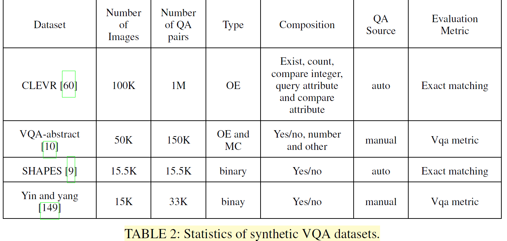

# VQA 综述阅读：

>   This passage is a reading note of a survey on VQA. Reading the raw passage is recommened:[A Comprehensive Survey on Visual Question Answering Datasets and Algorithms](https://arxiv.org/pdf/2411.11150)

## Abstract:

**Datasets**: We can devide the datasets of VQA into 4 catecories, namely:

•Available datasets that contain a rich collection of authentic images
•Synthetic datasets that contain only synthetic images produced through artificial means
•Diagnostic datasets that are specially designed to test model performance in a particular area, e.g., understanding the scene text
•KB (Knowledge-Based) datasets that are designed to measure a model’s ability to utilize outside knowledge

**Main paradigms**: In this survey, we wlii explore six main paradigms:

-   Fusion is where we discuss different methods of fusing information between visual and textual modalities.
-    Attention is the technique of using information from one modality to filter information from another. External knowledge base where we discuss different models utilizing outside information.
-    Composition or Reasoning, where we analyze techniques to answer advanced questions that require complex reasoning steps.
-    Explanation, which is the process of generating visual and/or textual descriptions to verify
    sound Reasoning.
-    Graph models which encode and manipulate relationships through nodes in a graph. 

We also discuss some miscellaneous topics, such as scene text understanding, counting, and bias reduction.

**Problems**: VQA compasses the following questions:

• Object recognition: What is behind the chair?
• Object detection: Are there any people in the image?
• Counting: How many dogs are there?
• Scene classification: Is it raining?
• Attribute classification: Is the person happy?

## Datasets

### General datasets

General datasets are the largest, richest, and most used datasets in VQA. General datasets contain many thousands of
real-world images from mainstream image datasets like MSCOCO [74] and Imagenet [32]. These datasets are notable for
their large scope and diversity. This variety is important as VQA datasets need to reflect the general nature of VQA. Although
these datasets do not necessarily capture the endless complexity and variety of visuals in real life, they achieve a close approximation.

### Synthetic datasets (虚构的)

Synthetic datasets contain artificial images, produced using software, instead of real images. A good VQA model should
be able to perform well on both real and synthetic data like  humans do. Synthetic datasets are easier, less expensive, and
less time-consuming to produce as the building of a large dataset can be automated. Synthetic datasets can be tailored
so that performing well on them requires better reasoning and  composition skills.

### Dignostic datasets

Diagnostic datasets are specialized in the sense that they test a model’s ability in a particular area. They are usually small in size and are meant to complement larger, more general datasets by diagnosing the model’s performance in a distinct area which may not have pronounced results in the more  general dataset.

### KB datasets

Sometimes it is not possible to answer a question with  only the information present in the image. In such cases, the required knowledge has to be acquired from external  sources. This is where KB datasets come in. They provide questions that require finding and using external knowledge. KB datasets can teach a model to know when it needs to search for absent knowledge and how to acquire that knowledge.

### Evaluation datasets

A model’s performance being correctly evaluated depends on the evaluation metric used. Unfortunately, a major problem of VQA is that there is no widely agreed upon evaluation metric. Many different metrics have been proposed.

## Algoritms

### Image Representation

**1. CNN**

-   When given an input image, a CNN goes through several  convolution and pooling layers to produce a C × W × H shaped output.
-   Devide the image into grids
-   Problem: be distracted by noise (could be solved by Attention mechanism); one boject could be devided into multi adjacent blocks. 

**2. Object Detection**

-   Example: Fast R-CNN

-   They produce multiple bounding boxes. Each bounding box usually contains an object belonging to a specific object class.
-   Devide the image into multiple 'bounding box'
-   Problem: possible information loss (some information that is not in the bounding boxes would be dismissed)

​								**CNN(left) and Faster R-CNN(right).**

### Questions Representation

Question representation in VQA is usually done by first embedding individual words and then using an RNN or a CNN to produce an embedding of the entire question.

>   Here are the explanations from Grok3:
>
>   1.   Take a question like "What color is the car?"
>
>   2.   **Embed individual words**: Convert each word into a vector using a word embedding technique (e.g., "What" → [0.1, 0.3, ...], "color" → [0.4, -0.1, ...], etc.).
>
>   3.   **Process with an RNN or CNN**:
>
>        -   RNN: Feed the vectors in sequence, and the final hidden state is the question embedding.
>
>        -   CNN: Apply filters to the sequence, pool the results, and get the question embedding.
>
>   4.   The output is a single vector representing the whole question, which the VQA model can then combine with image features to generate an answer.

### Fusion and Attention

We will tlk about it in the following part

### Answering

Here’s a quick summary of how "answering" works in Visual Question Answering (VQA) based on the "Answering" section (D) from the survey’s algorithm part:

In VQA, answering can be **open-ended** (free-form answers) or **multiple-choice** (choosing from options). There are two main ways to predict answers for open-ended VQA:

1. **Non-Generative Approach** (Most Common):
   - Treats answers as predefined classes (e.g., all unique answers in the dataset).
   - Two types:
     - **Single-Label Classification**: The model predicts one answer by outputting a probability distribution (using softmax) over all possible answers, trained to maximize the probability of the most agreed-upon answer from annotators. It’s simple but ignores multiple valid answers.
     - **Multi-Label Regression**: The model predicts scores for multiple candidate answers, reflecting how many annotators agreed (e.g., VQA-v1 uses a soft score like `min(# humans agreeing / 3, 1)`). This handles multiple correct answers better. The BUTD model pioneered this by treating it as a regression task, and most modern models follow this approach.
   - **Pros**: Easy to implement and evaluate.
   - **Cons**: Can’t predict new answers not seen in training.

2. **Generative Approach**:
   - Uses an RNN to generate answers word by word.
   - **Issue**: Hard to evaluate, so it’s rarely used.

For **Multiple-Choice VQA**:
- Treated as a ranking problem: The model scores each question-image-answer trio, and the highest-scoring answer wins.

**Answer Representation**:

- Most models use **one-hot vectors** (e.g., [1, 0, 0] for "dog") for answers, which is simple but loses semantic meaning—e.g., "cat" and "German Shepherd" are equally wrong compared to "dog."
- Some newer approaches embed answers into the same semantic space as questions (like word vectors), turning answering into a regression of answer vectors. This makes "German Shepherd" closer to "dog" than "cat," improving the model’s understanding and training signal.

In short, modern VQA answering leans toward multi-label regression for open-ended questions, using soft scores from annotators, while multiple-choice uses ranking. Efforts are ongoing to make answer representations more semantically rich!

### Mutilmodel Fusion

In order to perform joint reasoning on a QA pair, information from the two modalities have to mix and interact. This can be achieved by multimodal fusion. We divide fusion in VQA into two types, **vector operation** and **bilinear pooling**.

#### Vector operation

In vector addition and multiplication, question and image features are projected linearly through fully-connected layers to match their dimensions. 

>   Namely: fusion the vector of image and question by vector operation

-   cons: Bad Accuarcy

#### Bilinear pooling

>   The following content is generated by Grok3 for the raw survey is too hard for me.  ಥ_ಥ

**Bilinear Pooling** combines question and image feature vectors (e.g., both 2048-dimensional) by computing their **outer product**, capturing all interactions between them. For an output \( <z_i \) (answer score), it’s defined as \( z_i = x^T W_i y \), where \( x \) is the question vector, \( y \) is the image vector, and \( W \) is a huge weight tensor. However, with 3000 answer classes, this requires billions of parameters (e.g., 12.5 billion), making it computationally expensive and prone to overfitting. Different models tweak this to balance complexity and performance:

>   1. **MCB (Multimodal Compact Bilinear)**:
>       - Uses a trick from math: the outer product’s "count sketch" can be computed as a convolution of individual sketches.
>       - Replaces convolution with an efficient element-wise product in FFT space to indirectly get the outer product.
>       - Still has many parameters due to fixed random settings.
>
>   2. **MLB (Multimodal Low-rank Bilinear)**:
>       - Reduces parameters by decomposing \( W = U V^T \), turning \( z_i = 1^T (U_i^T x \circ V_i^T y) \) (where \( \circ \) is element-wise multiplication).
>       - Limits \( W \)’s rank to \( k \), cutting complexity, and adds a matrix \( P_i \) for further reduction.
>       - Downside: Slow to train and sensitive to tuning.
>
>   3. **MFB (Multimodal Factorized Bilinear)**:
>       - Tweaks MLB by adjusting \( U \) and \( V \) dimensions and adding **sum pooling** over windows of size \( k \): \( z = SumPool(U'^T x \circ V'^T y, k) \).
>       - MLB is a special case when \( k = 1 \). **MFH** stacks MFBs for richer pooling.
>
>   4. **MUTAN (Multimodal Tucker Fusion)**:
>       - Uses **Tucker decomposition**: \( W = \tau_c \times W_q \times W_v \times W_o \).
>       - \( W_q \) and \( W_v \) project question and image vectors, \( \tau_c \) controls interaction complexity, and \( W_o \) scores answers.
>       - MCB and MLB are simpler versions of this.
>
>   5. **BLOCK**:
>       - Uses **block-term decomposition**, balancing MLB (many small blocks, high-dimensional but weak interactions) and MUTAN (one big block, strong interactions but less accurate projections).
>       - Strikes a middle ground and often performs better.

In short, bilinear pooling fuses question and image data via their outer product, but raw computation is impractical. These models (MCB, MLB, MFB, MUTAN, BLOCK) reduce parameters in clever ways, trading off expressiveness (how much they capture) and trainability (how easy they are to optimize). Each improves on the last, with BLOCK aiming for the best of both worlds!

### Attention

Make the model to focus on the object that are more relavant to **questions** to filter out noise and imrove accuarcy.

####  Soft and hard attention

Both of **soft attention** and **hard attention** use the question to make a map, which assigns the objects on the picture to different values--the more relavent, the higher the value is.

But the difference lies in:

-   **Soft attention**  assigns all the object to a cretain value, do not dismiss any objects;
-   **Hard attention** discard those with low relavance, and only cares about those relavent to the questions

#### Grid and objct based attention

#### BOTTOM-UP AND TOP-DOWN ATTENTION

#### CO-ATTENTION AND SELF-ATTENTION

>   To get more about these attention machenism, read the raw paper.

### External Knowledge

Sometimes the model need more information to solve the problem,int that case, we need to give the model the capability to query an **External Knowledge Base** or **EKB**.

---

