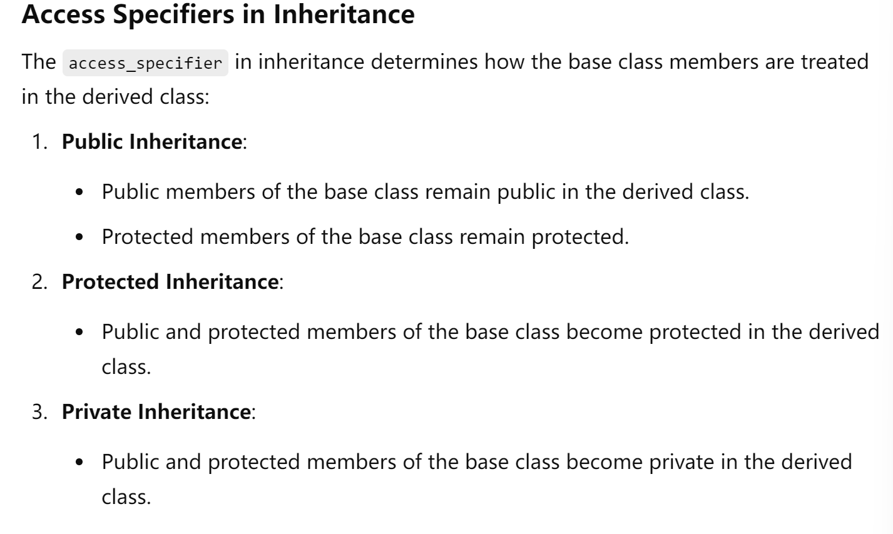

# class

## 定义类&创建实例

```cpp
class Car{
    public:
    	string owner;
  		void setOwner(string name){
			woner=name
        	};
};
//记得分号
Car Model_Y;
//创建一个Car的实例
Model_Y.setOwner('yama');
cout<<Model_Y.owner<<endl;
//output: Model_Y 
```

## 类访问修饰符

### 1. public：

可以在class的外部被访问

### 2. private:

只能在class的内部或者通过友元函数访问

### 3. protected:

只能在class的**内部**或者在子类的**内部**访问

---

### 实例：

```c++
#include<bits/stdc++.h>
using namespace std;
class Test{
    public:
    int a=0;
    double b=1;
    int  getPrivate(){
        return c;
    }
    private:
    int c=2;
    double d=4;
    protected:
    char ch='k';
};
//可以直接获取并修改到这里的的public成员，但是private和protected不能够直接通过实例获取到。

class sonClass: public Test{
    //采取public继承，有三种继承分别是public, private（by default）, protected.
    public: 
    char getFatherProtected(){
        return ch;
    }
};
int main(){
    sonClass son;
    Test t;
    cout<<t.a<<" "<<t.b<<" "<<t.getPrivate()<<endl;
    cout<<son.a<<" "<<son.b<<" "<<son.getFatherProtected();
}
```

>   注意
>
>   1.   protected和private无论在什么时候都不可以在类的外面通过实例直接访问到，如'instance.a'。
>   2.   protected中的成员可以在类和子类的内部访问。所谓内部访问其实就是只有在这个类的成员函数中才可以访问。
>   3.   private中的成员只有自己类和友元函数可以访问到。
>   4.   protected中的成员当然也可以被友元函数和友元

---

## 构析函数和折构函数

构析函数在创建的时候调用,折构函数在销毁的时候调用：

```cpp
class Car{
    Car(){
        printf("I am created!\n");
    }
    ~Car(){
        printf("I am destoryed!");
    }
};
```

如果构造函数有参数，那么要这个样子：

```cpp
Car car(paramater);
```

## 友元函数和友元类

友元函数在类的内部声明，但是并不是类的私有方法；友元函数可以访问private和protected的成员。

```cpp
class Car{
    public:
    string company="Tesla";
    void changeOwner(stirng newOwner){
        owner=newOwner;
    }
    private:
    string owner="yama";
    friend friendFunction(Car &car)；
    //友元函数可以访问到这里的private和protected方法
      friend class XiaomiCar;
    protected:
    string type="Model Y"; 
};

friendFunction(Car &car){
	cout<<car.owner<<endl; 
}

class XiaomiCar{
    pubilc:
  	void getOwner(){
	reutrn owner;
    }
    //友元类空访问所有的成员
}


```

## Inheritance

继承使得derived class获得base class的非private的properties和methods。

三种继承方式: 1. public 2. private 3. protected

### Public Inheritance

完全不变，public在derived class里面依旧是public；protected依旧是protected.

### Private Inheritance

public和protected都变成private，只能在类的内部访问，这也是默认的继承方式。

### Protected Inheritance

public变成protected

>   **无论哪种继承方式，都只改变原来类的protected和public的properties与methods；而private始终不变**



## 操作符重载

重载的操作符要在public中定义

```cpp
#include<bits/stdc++.h>
using namespace std;
class Complex{

    public:
    int real=0;
    int imaginary=0;
    Complex(int r, int m){
        real=r;
        imaginary=m;
    }
    Complex operator+(Complex& other){
        return Complex(this->real+other.real,this->imaginary+other.imaginary);
    }
};
void print(Complex& c){
    printf("%d+%di",c.real,c.imaginary);
}

int main(){
    Complex c1(1,1);
    Complex c2(2,3);
    Complex c3=c1+c2;
    print(c3);
}
```

