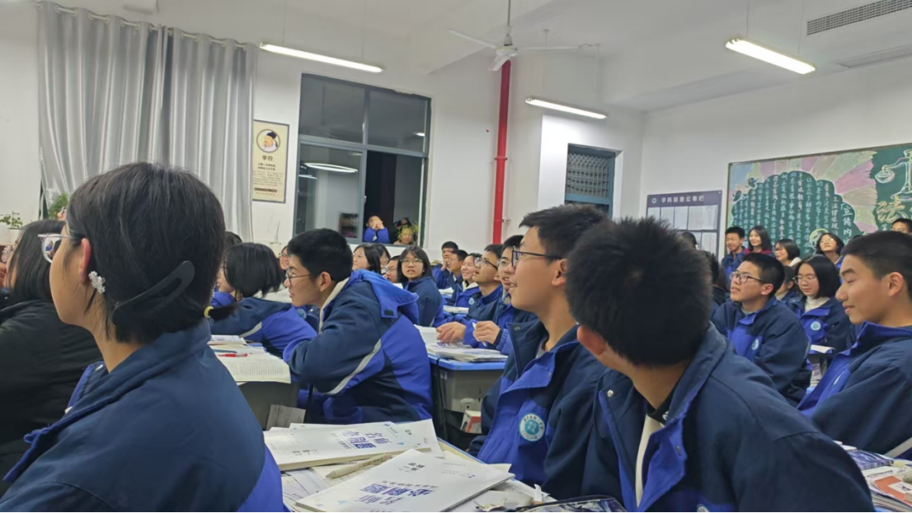
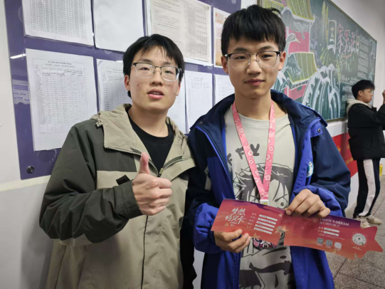
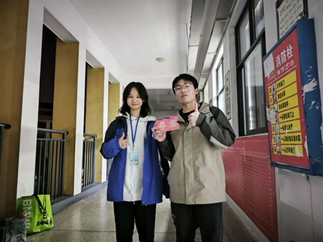
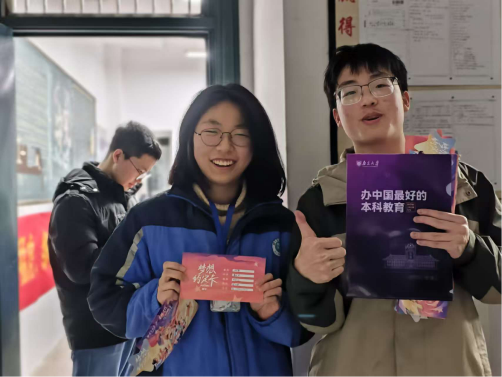
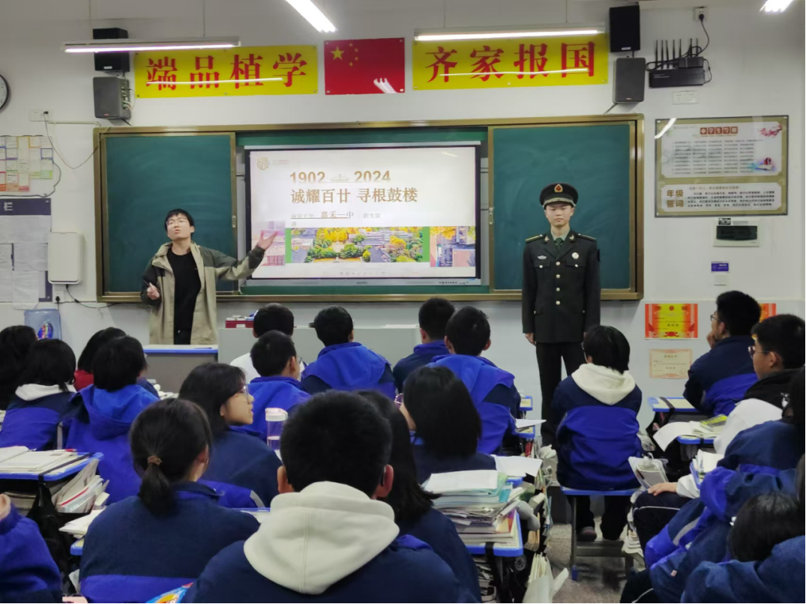

 点亮嘉禾一中，共赴梦想之约|2025南星梦想计划嘉禾一中站
       2025年1月19日晚6点40分，南京大学“南星梦想计划”宣讲活动在嘉禾一中拉开帷幕，第一站便是2202班教室。此次活动由嘉禾一中宣讲团队长雷业成带队，2201班、2202班以及2401班、2402班的同学们热情参与。

 

     活动伊始，雷业成同学详细介绍了南京大学的校园文化、专业特色与招生政策。在宣讲过程中，团队为同学们准备了丰富的文创物品，包括南大定制文件夹、“小蓝鲸”钥匙扣等等，其中“梦想约定卡”备受关注。同学们踊跃报名填写，一笔一划写下自己自己的名字、选课、联系方式，表达着对南京大学的向往，现场气氛热烈非凡。宣讲结束后，雷业成与同学们亲切合影，记录下这一充满希望的时刻。

     
 

       随后，宣讲团队拜访了老师们，与他们交流学生的学习情况，分享在南京大学的成长经历。受老师邀请，团队前往高一年级尖子班再次展开宣讲，并毫无保留地分享了高效的学习方法，赢得同学们阵阵掌声。

 

       活动结束后，同学们热情未减，将我们团队成员团团围住，积极询问关于南京大学的更多信息和学习方法等。此次“南星梦想计划”宣讲活动，不仅让嘉禾一中的同学们深入了解南京大学，更在他们心中种下梦想的种子。相信在未来，会有更多嘉禾一中的学子带着梦想奔赴南京大学，开启人生新征程。
